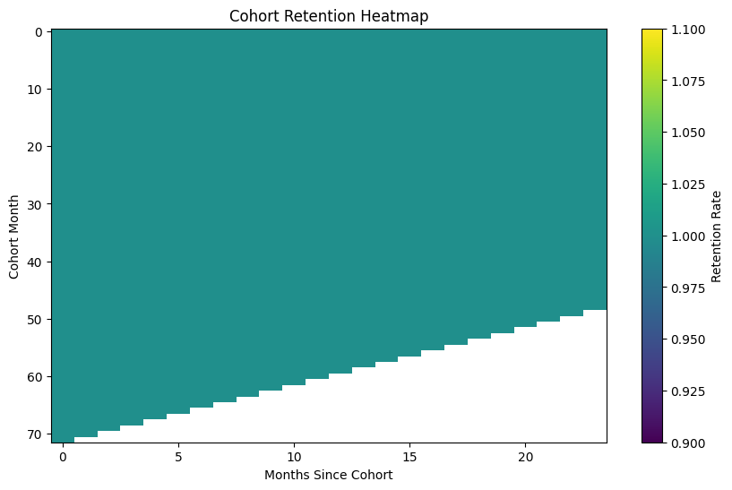
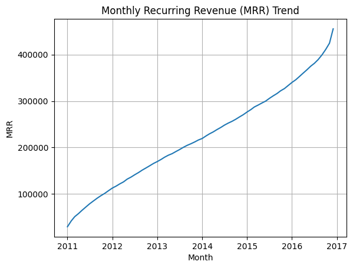
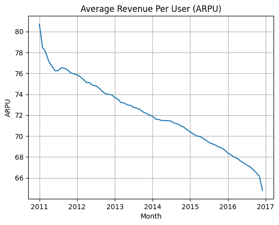
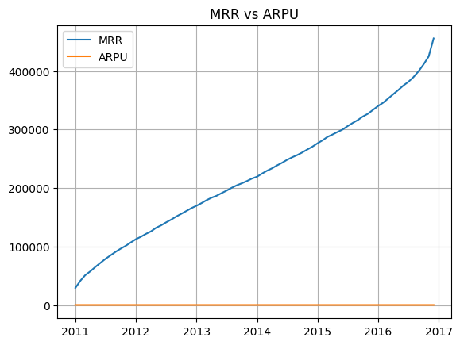
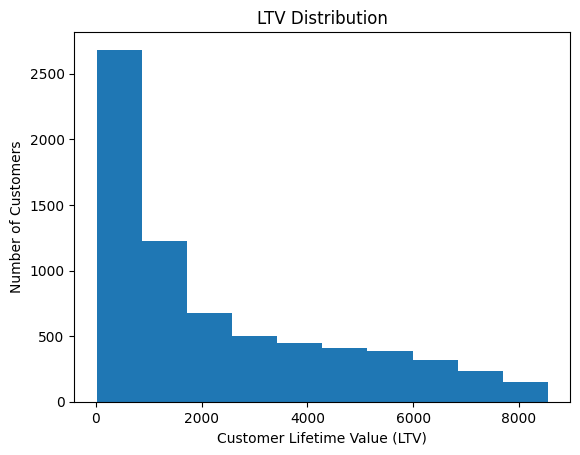
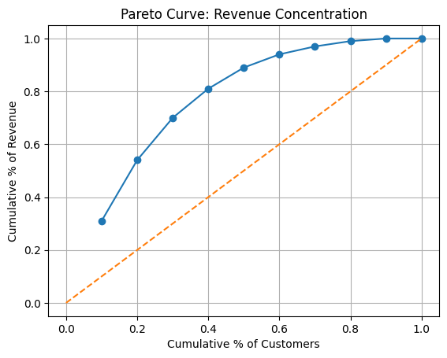

# SaaS Revenue Intelligence: MRR, Cohort Retention & LTV Analytics

## Overview

This project analyzes subscription-based business performance using SQL and Python.
It reconstructs customer lifecycle from snapshot data and derives key SaaS metrics.

## Dataset

Telco customer dataset (~7K customers)

## Tech Stack

* SQL (PostgreSQL)
* Python (Pandas, Matplotlib)

---

## Key Metrics Built

* Monthly Recurring Revenue (MRR)
* Customer Churn Rate
* Cohort Retention Analysis
* Average Revenue Per User (ARPU)
* Customer Lifetime Value (LTV)
* Revenue Concentration (Pareto Analysis)

---

## Key Insights

* MRR shows consistent growth driven by customer acquisition
* ARPU declines over time, indicating revenue growth is volume-driven
* Cohort retention appears flat due to snapshot-based reconstruction using tenure
* LTV distribution is right-skewed, with a small group of high-value customers
* Top 20% of customers contribute ~54% of total revenue

---

## Visualizations

### Cohort Retention Heatmap



### MRR Trend



### ARPU Trend



### ARPU Vs MRR Trend




### LTV Distribution



### Pareto Curve



---

## Project Structure

* `/sql` → all SQL transformations
* `/data` → processed datasets
* `/notebooks` → analysis and visualizations
* `/images` → charts for quick preview

---

## How to Run

1. Execute SQL scripts in order (01 → 08)
2. Export results as CSV into `/data`
3. Run notebook:

```
notebooks/analysis.ipynb
```

---

## Notes

This dataset is a snapshot. Customer lifecycle was reconstructed using tenure, which results in flat retention curves until churn events.
